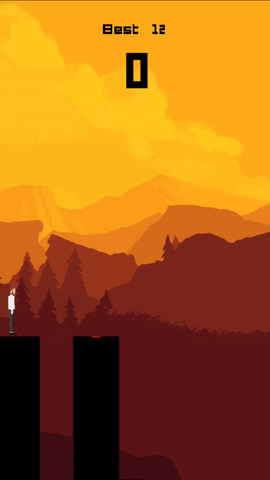
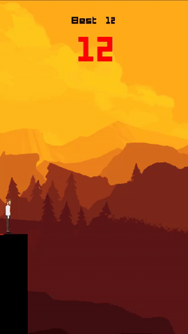
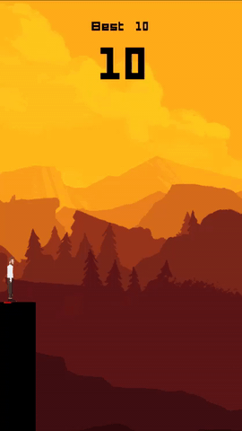
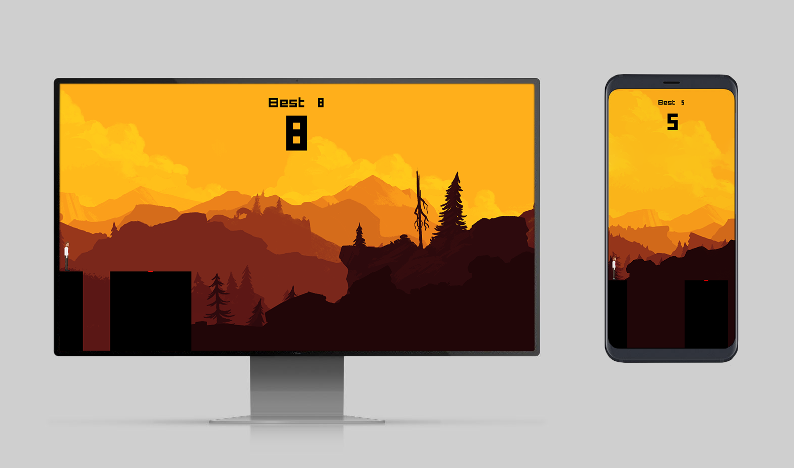

# Stick Hero on PyGame
This is a recreation of the Stick Hero game published by Ketchapp and created by Ubisoft Mobile.

## Create stick of the right size to get to the next platform.
The size and distance of the next platform is random.

## If you fall short or overshoot, it resets your score. Instant retry!
Your highest score is still shown up there.

## If you hit the red inner platform you get a bonus.
The first time you get 1 more point. If you land a second stick on the red platform, you get 2 points and so on.

## Feature an infinite parralax background
Assets are taken from Firewatch's website.

## Compatible in portrait and landscape mode.

